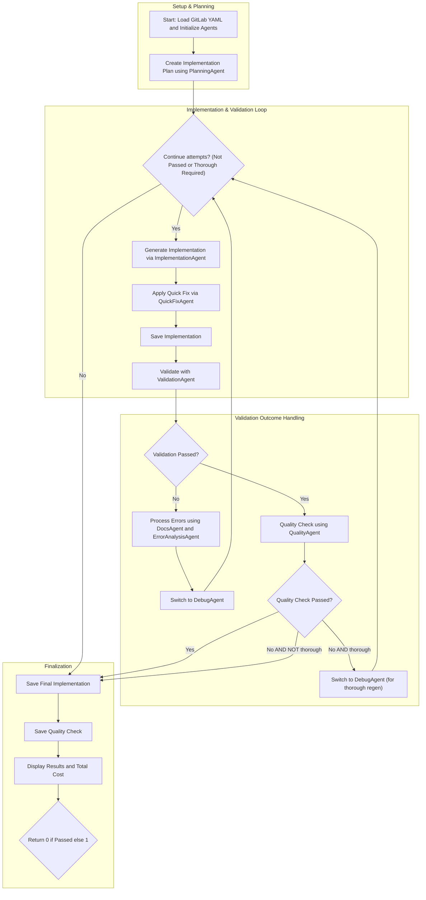

# GitLab to GitHub Convertor

A Python-based tool that uses language models to automate the conversion of GitLab CI/CD configuration files into equivalent GitHub Actions workflows. The conversion process involves multi-stage reasoning and validation to produce a working and standards-compliant result.

## Features

- **Planner Agent**: Analyzes the original GitLab file and advises on the optimal conversion approach, including potential edge cases.
- **Implementation Agent**: Translates the GitLab YAML into a GitHub Actions workflow.
- **Quick Fix Agent**: Applies immediate improvements or corrections to the initial implementation.
- **Validation Agent**: Uses `actionlint` to verify the generated workflow. Up to 3 validation attempts are performed with automatic error-driven refinement.
- **Quality Agent**: Reports on the quality of any yaml which passes linting to check it implements the original intention of the GitLab file

## Installation

### Requirements
- Python 3.8+
- [`uv` package manager](https://docs.astral.sh/uv/) (recommended)
- [`actionlint`](https://github.com/rhysd/actionlint) installed and available in your system's PATH

### Steps

#### MacOS / Ubuntu / Windows
```bash
# Clone the repository
git clone https://github.com/ohnotnow/gitlab-to-github-convertor.git
cd gitlab-to-github-convertor

# Install dependencies using uv
uv sync
```

## Usage

```bash
export OPENAI_API_KEY=sk-......
export OPENROUTER_API_KEY=..... # depending which provider you are using
uv run main.py --gitlab-yaml path/to/.gitlab-ci.yml [--max-attempts 3] [--thorough]
```

### Arguments
- `--gitlab-yaml`: Path to the GitLab CI YAML file to convert (**required**)
- `--max-attempts`: Maximum number of attempts for fixing invalid workflows (default: 3)
- `--thorough`: If the final quality check fails, retry the rewrite

### Output
- The converted GitHub Actions workflow will be saved as `output_<timestamp>.yml` in the working directory.
- The quality check output report is saved as `output_<timetamp>_quality_check.md`
- Console output includes detailed logs for planning, implementation, validation, and total token cost.

### Providers/Models

You can swap between OpenRouter or OpenAI directly by setting a `LLM_PROVIDER` environment variable or passing a `--provider` flag.  You can also specifiy a model name by passing `--model` or setting `LLM_MODEL`.  For example

```bash
uv run main.py --gitlab-yaml path/to/.gitlab-ci.yml --provider openrouter --model "google/gemini-2.5-pro-preview-03-25"

export LLM_PROVIDER=openai
export LLM_MODEL="o3-mini"
uv run main.py --gitlab-yaml path/to/.gitlab-ci.yml
```

You can see the fallback defaults by running :
```bash
uv run main.py --help
```

## Workflow diagram


## License

This project is licensed under the MIT License. See the `LICENCE.md` file for details.
